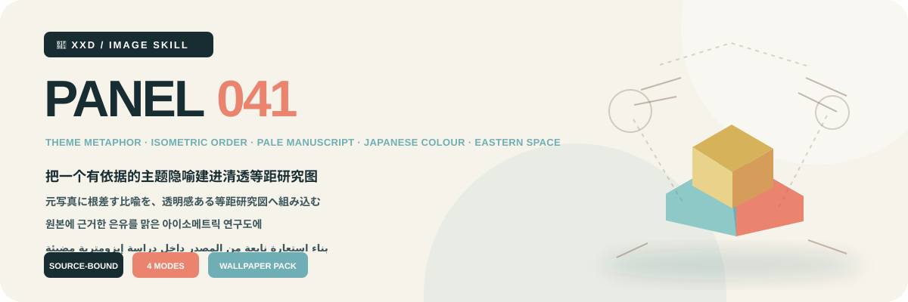
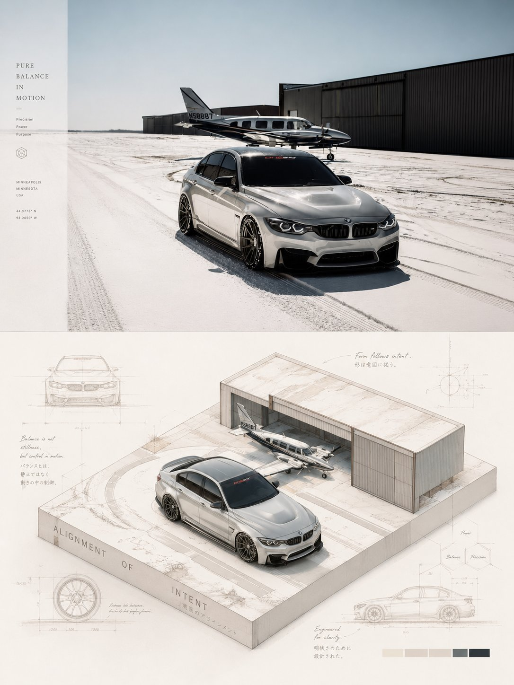
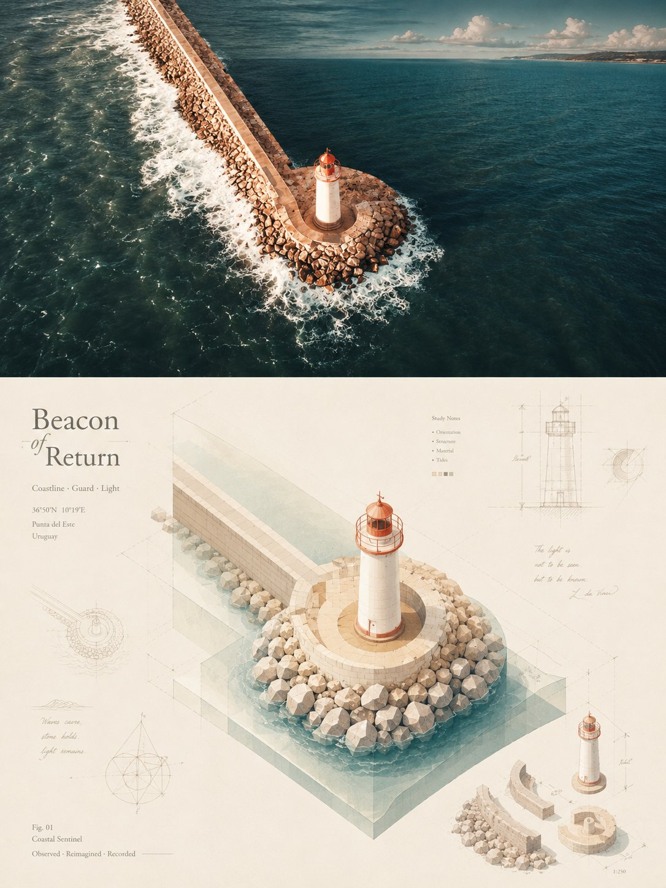
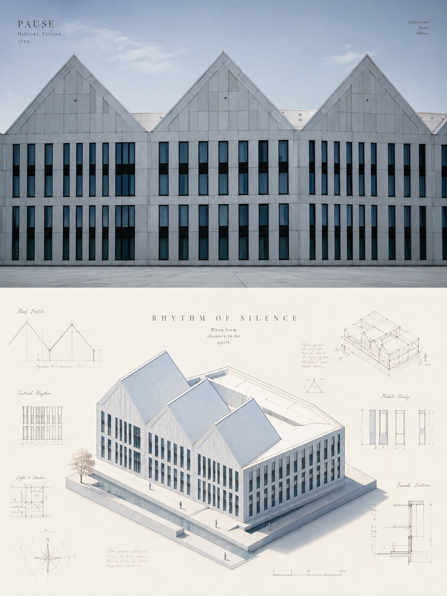
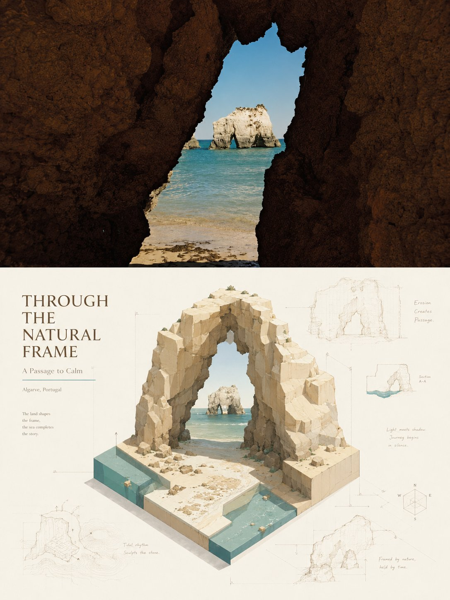

<p align="center"></p>

<div align="center">

# 🦁 XXD Panel 041

### 把一个有依据的主题隐喻建进清透等距研究图

[](./SKILL.md)
[](#)
[](#)

<strong>简体中文</strong> · <a href="README.en.md">English</a> · <a href="README.ja.md">日本語</a> · <a href="README.ko.md">한국어</a> · <a href="README.ar.md">العربية</a>

</div>

<div>

> 主题隐喻 · 等距秩序 · 淡手稿 · 日系清透色 · 东方留白

统一等距模型保住源图身份，一个几何主题隐喻成为底座、缺口、路径、包围或负形；极淡研究草图只在清透成品周围留下从属的思考痕迹。

## 为什么需要这套 Skill

这套风格依赖每一张源图，不是可替换内容的装饰预设。它遵循这条重构链：

```text
锁定身份与结构轴线 → 保留三个决定性线索 → 在统一等距网格中重构 → 提炼一个有源图依据的隐喻 → 让隐喻决定底座、切面、路径、包围、承托或负形 → 使用源图衍生日系清透色与哑光色面 → 环绕极淡分析手稿 → 让文案对齐轴线与研究辅助线
```

如果换成无关照片后，辨识度、构造、位置、材质、颜色、留白与文案都不发生实质变化，结果就不属于这套 Panel。

## 视觉契约

- 从剪影、比例、轴线、开口、层级、方向、动作或关系中保留至少三个源图专属线索。
- 使用一套统一等距轴线重构有意义的体块、层级、切面与空间关系，不得只是把原物做成通用3D模型。
- 从真实内容、动作、结构或象征中提炼一个主题意象，让它因果性地控制底座、切面、缺口、路径、包围、承托、悬浮或负形。
- 使用源图衍生的高明度、清透、柔和日系色，浅暖基础、哑光表面和轻微可读阴影，不得塑料高光或厚重CG。
- 只加入极淡的源图相关轮廓草图、结构拆解、局部放大、比例线、箭头、几何推演、自然观察和微注释；它们只是从属思考痕迹。
- 允许有源图依据的偏置、悬浮、尺度反差、裁切与东方留白，但始终只保留一个视觉中心。

完整审美约束与拒绝项写在 Skill 和生产提示词中；它们保留原始提示词的审美动机，但不会把历史 3:4 画布变成隐藏默认值。 [SKILL.md](SKILL.md) · [production prompt](references/xxd-panel-041-prompt.en.md)

## 样张 · 来自 X

> [小小东（@xiaoxiaodong01）](https://x.com/xiaoxiaodong01/status/2091001986519068891) · 2026 年 8 月 22 日<br>
> GPT2 × isometric × 达·芬奇 × 美学提示词<br>注：原推文正文中的 “VOL.401” 为编号笔误；作者已确认该样张归属 XXD Panel 041。

<table>
  <tr>
    <td width="50%"><a href="https://x.com/xiaoxiaodong01/status/2091001986519068891"></a></td>
    <td width="50%"><a href="https://x.com/xiaoxiaodong01/status/2091001986519068891"></a></td>
  </tr>
  <tr>
    <td width="50%"><a href="https://x.com/xiaoxiaodong01/status/2091001986519068891"></a></td>
    <td width="50%"><a href="https://x.com/xiaoxiaodong01/status/2091001986519068891"></a></td>
  </tr>
</table>

<p align="center"><a href="https://x.com/xiaoxiaodong01/status/2091001986519068891">查看原推文与完整提示词 →</a></p>

这些样张用于展示 041 的美学动机，不会把样张中的主体、构图、配色、文案或旧画幅变成生成参考或当前默认值。

## 四种可组合输出模式

可用 `1`、`1+3`、`1、2、4` 或 `全部` 选择一个或多个模式；`全部` 每张源图输出 7 个独立 PNG。模式确定后，Skill 会在生图前继续询问整张最终成品的画幅：`3:4` 原提示词画幅、明确跟随原图、常用比例，或自定义比例／准确像素。不会再静默套用源图尺寸。

| 模式 | 画幅逻辑 | 成品 |
| --- | --- | --- |
| `top-bottom` | 用户确认的整张成品画幅 | 一次生成完整画布：高保真原图在上，041 设计在下，约 50/50 |
| `left-right` | 用户确认的整张成品画幅 | 一次生成完整画布：高保真原图在左，041 设计在右，约 50/50 |
| `design-only` | 用户确认的整张成品画幅 | 041 设计铺满画布，不显示原照片 |
| `wallpaper-pack` | 逐设备确认 | 手机、iPad、电脑、儿童手表四张独立 PNG |

双联默认把原图作为高保真垫图／编辑参考，用一套完整提示词直接生成一张整体成品，让摄影、设计、色彩、光线、文字与含义自然呼应。只有完整画布针对性重试仍失败、用户要求原片逐像素不变、当前通道无法实现目标画幅，或需要无创像素校准时，才启用确定性拼合兜底。

壁纸可选连贯或独立。连贯套装先批准一张 iPad 定调图，另外三张分别参考原图＋同一定调图重新构图；独立套装的四张都只参考原图。两者都不会裁切其他设备成品或串联衍生图。

## 文案与语言

正式生成前确认自动文案、准确自定义文案或无文字；语言跟随目标受众而不是命令语言，用户给出的准确文案逐字保留。

本项目的文案规则： 使用一个与源图强绑定的简短标题，以及仅有必要的地点、状态或微型注释；让目标语言文字沿等距轴、隐喻边界、结构切面或淡研究线排列，成为艺术出版物的信息层。

## 完整画布优先与位图边界

图像模型负责整张成品的审美重构，双联也默认一次直出完整画布。`scripts/compose_panel.py` 只保留为条件明确的兜底、无创尺寸校准和只读审计工具，不再预先规划每次任务，也不评价审美是否成功。

全部交付为 PNG 位图。每次调用都在 `~/Desktop/xxd/` 下创建新任务；已配置图像通道只返回脱敏状态，不公开供应商、端点、凭据、请求头、提示词、响应或账户信息。SVG、HTML、Canvas、图表和程序绘图不能替代最终作品。

## 勾选式选择与快捷参数

当运行环境提供真正的交互控件时，Skill 会优先使用卡片式选择：成品模式和普通成品尺寸均可多选，文字方式与壁纸关系为单选。尺寸提供自动适配、跟随原图、1:1、3:4、4:3、4:5、5:4、2:3、3:2、9:16、16:9、21:9、5:7、7:5 和自定义比例／像素。没有交互控件时，会自动改用清楚的多行编号菜单，不显示无法点击的假复选框。

所有设置也可以作为变量直接跟在调用指令后：

```text
/xxd-panel-041 photo.jpg --mode top-bottom,design-only --size auto,3:4,9:16 --text auto --locale ja-JP
```

可使用 `--mode`、可重复或逗号分隔的 `--size`、`--text auto|custom|none`、`--locale`、`--copy`、`--wallpaper linked|independent`、`--wallpaper-size` 和 `--out`。参数齐全时跳过全部问询并直接生成；参数不完整时只补问缺失项。不同比例会分别重新构图，四端壁纸仍是独立设备分支，不与普通尺寸机械相乘。

## 生图模型优先级

GPT Image 2 是默认首选，并继续执行本项目现有的高保真垫图、生成前确认整张画幅、双联一次生成完整画布、脚本仅作条件式兜底等逻辑。

当当前工具或已配置兼容通道确实可用，并能满足原图保真、整张成品比例、目标语言文字和连贯壁纸多图参考等要求时，也支持 Seedance 5.0 Pro、Nano Banana Pro（Gemini Image Pro）、Nano Banana 2（Gemini Image Flash）或其他兼容位图模型。备用模型只替换生成通道，不得改变模式、画幅、文案、语言、壁纸关系和完整画布优先策略。

如果没有合适的生图通道，Skill 会请用户启用生图工具或提供 API Key。用户主动提供的凭据可以用于当前任务，但不得在回复或日志中回显、展示或泄露；未经用户明确要求，不会长期保存凭据或修改供应商、账户、计费及全局路由配置。

## 开始使用

```bash
git clone https://github.com/nevertoday/xxd-panel-041.git
mkdir -p ~/.codex/skills
ln -s "$(pwd)/xxd-panel-041" ~/.codex/skills/xxd-panel-041
```

Claude Code 用户可把同一文件夹链接到 `~/.claude/skills/xxd-panel-041`. 安装后请重启 Agent 会话。

```text
$xxd-panel-041
Use this photograph, ask me for the modes and copy setting, then generate fresh raster outputs.
```

完整规格: [Skill 工作流](SKILL.md) · [原始风格档案](references/041-source.md) · [英文生产提示词](references/xxd-panel-041-prompt.en.md) · [中文生产提示词](references/xxd-panel-041-prompt.zh-CN.md)

## 关于 XXD

XXD 是小小东品牌名的缩写，本项目由小小东创建并维护： [@xiaoxiaodong01](https://x.com/xiaoxiaodong01).

## 支持与会员

### 深度咨询 · 299 元／小时

一对一深入咨询 Skills 的使用与工作流，通过微信联系小小东预约。 [WeChat](https://xiaoxiaodong.pages.dev/assets/wechat-qr.png)

### 小小东 Skills 用户交流群 · 99 元

一次付费加入 Skills 用户交流群，用于工作流分享和用户间讨论；不包含按小时计费的一对一咨询。

### 知识星球＋成员提示词库 · 699 元／年

知识星球和成员提示词库是一份会员费用：从任一入口开通后，通过微信联系小小东获取另一边的权益。

[Knowledge Planet](https://wx.zsxq.com/group/15554814142882) · [Member Prompt Library](https://vip.xiaoxiaodong.ai/)

<p align="center"><a href="https://xiaoxiaodong.pages.dev/assets/wechat-qr.png"></a></p>

<div align="center"><strong>理性成品与思考痕迹，共处一片安静空间。</strong></div>

---

<div align="center">

## ☕ 支持这个开源项目

算力赞助请使用小小东自己的微信或支付宝赞赏码；赞助完全自愿，不改变开源项目的访问权限。


<table><tr>
<td align="center"><a href="https://colors.xiaoxiaodong.ai/docs/images/wechat-reward-qr.png"></a><br><strong>WeChat</strong></td>
<td align="center"><a href="https://colors.xiaoxiaodong.ai/docs/images/alipay-reward-qr.png"></a><br><strong>Alipay</strong></td>
</tr></table>

</div>
</div>
